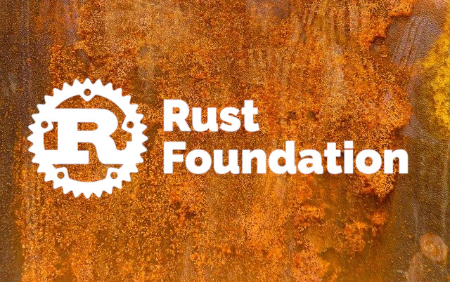
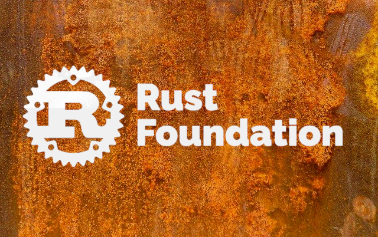

# Steganography 
Steganography is a technique to hide an image inside another.

## Example

If we mixing  




(cover image)

**( + )** 


(image to merge)

It's give us 



## How to use it

Encrypt
```
cargo run encrypt --input="filename_first_image" --input="filename_second_image" --output="expected_output_filename"

# example
cargo run encrypt --input="./sample/sample1.jpg" --input="./sample/sample2.jpeg" --output="./results/encrypt.png"
```

Decrypt
```
cargo run decrypt --input="input_image"  --output="expected_first_output_filename" --output="expected_second_output_filename"

# example
cargo run decrypt --input="./results/encrypt.png"  --output="./results/decrypt_1.png" --output="./results/decrypt_2.png"

```


